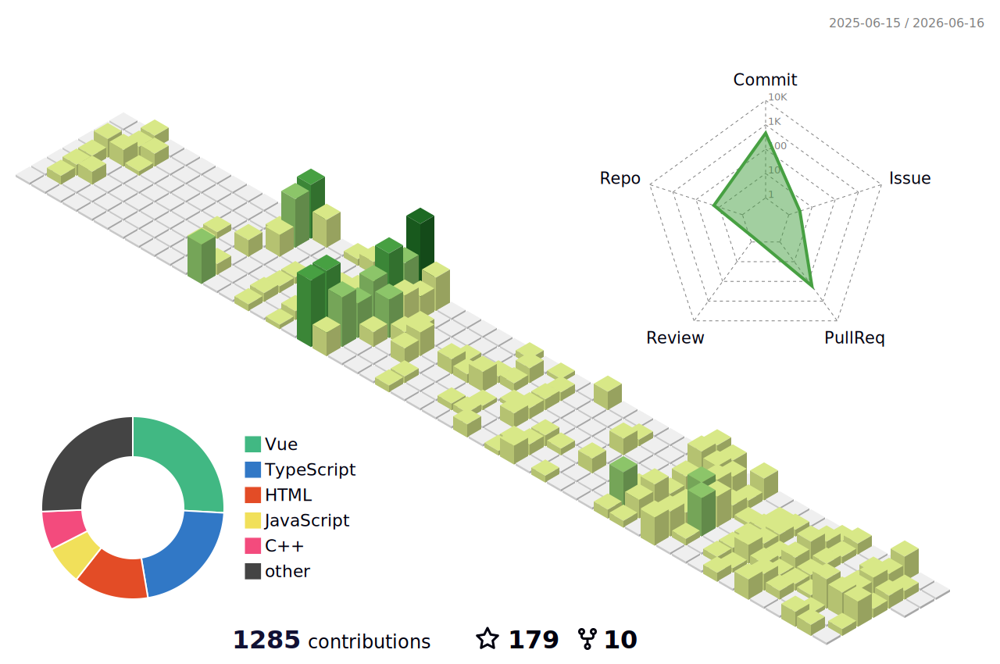

### Hi there 👋

- 🎓 Student at [Xiamen University (厦门大学)](https://www.xmu.edu.cn).
- 🌱 Interested in *web development*, *computer graphics* and *computer networks*.
- 🚀 Building [Tripy-Web](https://github.com/lifuyue/Tripy-Web) and [Changdang Lake Cultural Communication Platform](https://github.com/lifuyue/Changdang_Lake_Cultural_Communication_Platform).
- 📫 Email: [l1fuyue@icloud.com](mailto:l1fuyue@icloud.com).
- 🪺 Twitter: [@L1fuyue](https://twitter.com/L1fuyue).
- ✨ Blog: [lifuyue.github.io](https://lifuyue.github.io).

### About me :octocat:

A student who loves building things for the web.

### Metrics 📈

  

  

